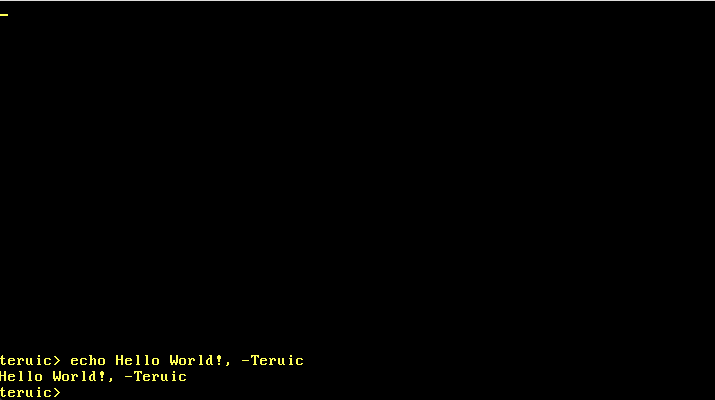

# Teruic OS

Teruic OS is a 64-bit (`x86_64`) bare-metal operating system written in Rust (`#![no_std]`) and designed specifically for privacy, cybersecurity analysis, developer tools, and computer science education.




## Features

- **Language:** Written in nightly Rust (`#![no_std]`, `#![no_main]`).
- **Bootloader:** Bootstrapped via `bootloader` (v0.9).
- **Virtual File System:** Thread-safe in-memory VFS built on `BTreeMap`.
- **Shell & Terminal:** Interactive kernel shell supporting built-in commands (`ls`, `cat`, `write`, `exec`, `c_app`, `info`, `uptime`) and batch scripts.
- **Hardware Interrupts:** 8259 PIC and IDT configuration (PIT timer counter and PS/2 keyboard processing).
- **Multilanguage Core:** C FFI interface for running raw C drivers/binaries; future support planned for a Java bytecode runtime.


## Quickstart

### Prerequisites
Rust Nightly (`rustup toolchain install nightly`)
- `x86_64-unknown-none` target (`rustup target add x86_64-unknown-none`)
- `cargo bootimage` (`cargo install bootimage`)
- `qemu-system-x86_64`

### Building and Running

```bash
# Build the bootable image
cargo bootimage

# Run in QEMU
qemu-system-x86_64 -drive format=raw,file=target/x86_64-unknown-none/debug/bootimage-teruic_os.bin
