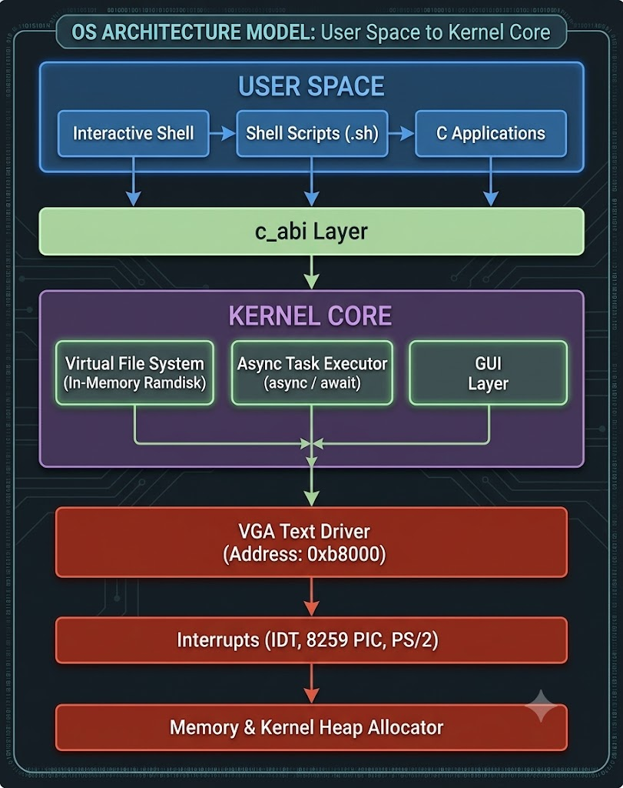

# Teruic OS — Architecture Overview

Teruic OS is a bare-metal, 64-bit (x86_64-unknown-none) operating system which has been written in Rust (using the flags !#![no_std] and !#![no_main]).

## 1. Subsystem Layout

I know i used gemini for generating image but it is same as what the actual architecture is as so for now i will keep this later i will update the image.

## 2. Kernel Initialization Sequence (src/main.rs)

1. **Bootloader Handshake:** The crate called `bootloader`, version v0.9, enables 64-bit long mode and then jumps to the function `_start`.
2. **Memory Setup:** The page table mapping is initialised (in memory.rs) and the global heap allocator is set up (in allocator.rs).
3. **Interrupt Vectoring:** The IDT (in interrupts.rs) is loaded and the 8259 PIC IRQs are remapped (the timer tick is approximately 18.2Hz on vector 32 and the PS/2 keyboard scancodes are on vector 33).
4. **VFS Initialization:** the root in-memory `VirtualFileSystem` ramdisk is mounted (`vfs.rs`).
5. **Async Execution:** The main shell loop task is started using the kernel executor (`task/`).
